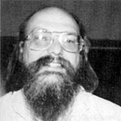
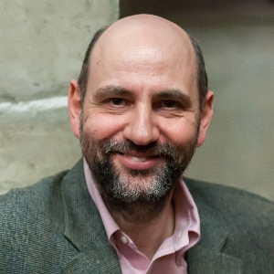
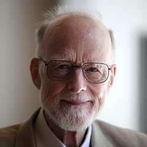

# awesome-it-quotes

<h3 align="center">
	
	 
    This is an list of awesome IT quotes. The aims is to get together all relevant quotes said over the history of IT.
</h3>

## Contents
- [Edsger Dijkstra](#edsger-dijkstra)
- [Ken Thompson](#ken-thompson)
- [Linus Torvalds](#linus-torvalds)
- [Martin Fowler](#martin-fowler)
- [Steve Jobs](#steve-jobs)
- [Steve McConnell](#steve-mcconnell)
- [Tony Hoare](#tony-hoare)

## Contribution Guidelines
There's no restriction to contribution at all. The only things that we should point out is:
- Before submit your pull request, make sure of the authenticity of quote that you are adding.
- Try to respect our README.md template.
- If you have any question, you can use our Issue Page.

## Quotes
| Quote | Author |
|:-:|:-:|
| “Raise your quality standards as high as you can live with, avoid wasting your time on routine problems, and always try to work as closely as possible at the boundary of your abilities. Do this, because it is the only way of discovering how that boundary should be moved foward.” | 

    Edsger Wybe Dijkstra (Computer scientist and an early pioneer in many research areas of computing science. Turing Award Winner) |
| “One of my most productive days was throwing away 1000 lines of code.” | 

    Ken Thompson (computer scientist, early developer of UNIX OS) |
| “Most good programmers do programming not because they expect to get paid or get adulation by the public, but because it is fun to program.”    “Software is like sex; it's better when it's free.”    “Artists usually don't make all that much money, and they often keep their artistic hobby despite the money rather than due to it.”    “I often compare open source to science. To where science took this whole notion of developing ideas in the open and improving on other peoples' ideas and making it into what science is today and the incredible advances that we have had. And I compare that to witchcraft and alchemy, where openness was something you didn't do.” | 

    Linus Torvalds (Finnish American, software engineer and hacker, principal force behind the development of the Linux kernel) |
| “Any fool can write code that a computer can understand. Good programmers write code that humans can understand.” | 

    Martin Fowler (author and speaker on software development) |
| “Great things in business are never done by one person. They're done by a team of people.”    “Innovation distinguishes between a leader and a follower.”    “Technology is nothing. What's important is that you have a faith in people, that they're basically good and smart, and if you give them tools, they'll do wonderful things with them.”| 

    Steve Jobs (Former co-founder, chairman, and chief executive officer (CEO) of Apple Inc) |
| “Good code is its own best documentation. As you’re about to add a comment, ask yourself, ‘How can I improve the code so that this comment isn’t needed?'” | 

    Steve McConnell (author of many software engineering books including “Code Complete”) |
| “There are two ways of constructing a software design: One way is to make it so simple that there are obviously no deficiencies, and the other way is to make it so complicated that there are no obvious deficiencies. The first method is far more difficult.” | 

    Tony Hoare (British computer scientist, winner of the 1980 Turing Award) |

  
   
  To the extent possible under law,
  <a rel="dct:publisher"
     href="https://github.com/victorlaerte/awesome-it-quotes">
    Victor Laerte de Oliveira</a>
  has waived all copyright and related or neighboring rights to
  Awesome IT Quptes.
This work is published from:

  United States.

